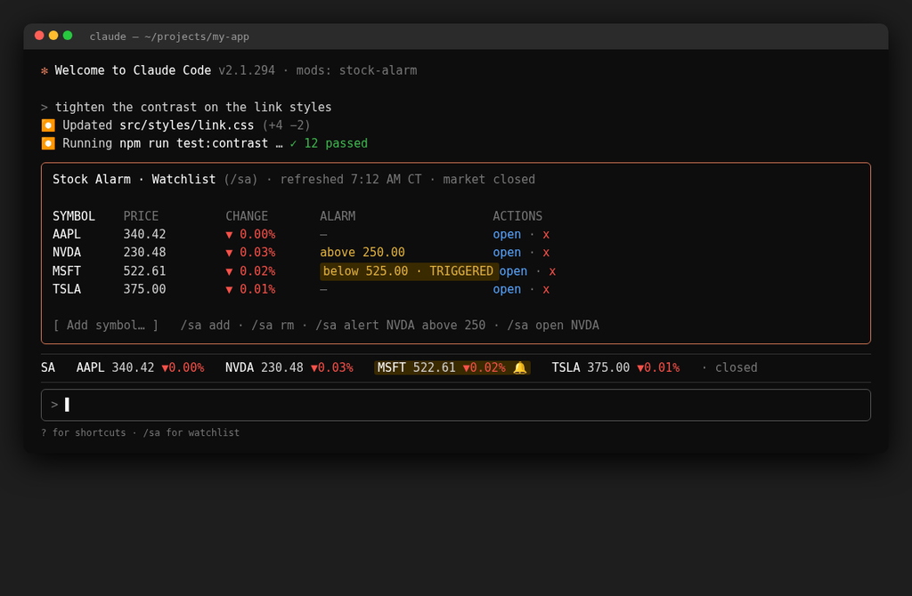

# Stock Alarm for Claude Code

Live stock prices in Claude Code. This **mod** (a Claude Code plugin with a hooks module) keeps your watchlist in view while you work:

- **Watchlist table docked above the prompt**: a boxed SYMBOL / PRICE / CHANGE / ALARM / ACTIONS table (5 rows by default) with an "Add" field and a command footer. It stays on screen while you chat, and a triggered alarm is highlighted in the ALARM column.
- **Ticker strip under it**: `SA  AAPL 340.42 ▲0.72%  NVDA 230.48 ▼0.03%  MSFT …`, green when a stock is up, red when it's down, and `closed` when the US market is shut. In a short or narrow terminal the table folds away and only this strip shows.
- **`/sa` watchlist pane**: the full watchlist with price, change, alerts, an "Add" field, an `open` button per row (opens the symbol's quote page on [Stock Alarm Pro](https://pro.stockalarm.io), e.g. `https://pro.stockalarm.io/quote/NVDA`), and an `x` to remove it.
- **Local price alerts**: type `/sa alert NVDA above 250` and press Enter. When the price crosses, NVDA is highlighted in the table, strip and pane, and a notification pops up in Claude Code.



*Mockup: the docked watchlist table with a triggered MSFT alert, and the ticker strip above the prompt during a normal Claude Code session.*

## Requirements

- Claude Code **2.1.287 or later** (mods first shipped in 2.1.287). Check with `claude --version`.
- No account, API key, or extra software.

## Install

```bash
claude plugin marketplace add shawn14/claude-stock-alarm
claude plugin install stock-alarm@stock-alarm
```

Or, inside a Claude Code session: `/plugin marketplace add shawn14/claude-stock-alarm`, then `/plugin install stock-alarm@stock-alarm`.

Restart Claude Code (`/restart`) or run `/reload-plugins` in an open session. The watchlist table and ticker strip appear above the prompt within a few seconds.

Update: `claude plugin marketplace update stock-alarm && claude plugin update stock-alarm@stock-alarm`
Turn it off: `claude plugin disable stock-alarm@stock-alarm` (or `/plugin` → Installed → stock-alarm)
Remove it: `claude plugin uninstall stock-alarm@stock-alarm && claude plugin marketplace remove stock-alarm`

## Quick start

1. Restart Claude Code (type `/restart`) or run `/reload-plugins` after installing.
2. Click into the prompt at the bottom of Claude Code (where the `>` is).
3. Type `/sa alert NVDA above 250` and press Enter.
4. The alarm shows in the ALARM column of the watchlist table. When the price crosses 250, the row is highlighted and you get a notification.

More things to try:

- `below` works too: `/sa alert NVDA below 200`. Use any symbol and any price.
- `/sa alert NVDA clear` removes the alarms on NVDA.
- `/sa add AMD` adds a symbol to your watchlist.
- `/sa` on its own opens the full watchlist.
- `/sa help` lists every command.

Good to know:

- Alarms are local to Claude Code on this computer. They only check prices while Claude Code is open, and they don't go to your phone. For alerts on your phone, get the Stock Alarm app for [iPhone](https://apps.apple.com/us/app/stock-alarm-alerts-tracker/id1465535138) or [Android](https://play.google.com/store/apps/details?id=com.StockMarketAlarms.StockAlarm).
- These commands don't use Claude tokens. They run inside the mod, not through Claude.

## Usage

Type these in the prompt and press Enter. Not sure what to type? Run **`/sa help`**. The ticker strip ends with a dim
`· /sa help` hint when there's room for it (it's the first thing dropped in a narrow terminal, so it never pushes a quote
off), and the first time the mod runs it shows a one-time tip: *Stock Alarm: to set an alarm, type /sa alert NVDA above
250 and press Enter · /sa opens your watchlist · /sa help for more*.

| Command | What it does |
| --- | --- |
| `/sa` | Open the full watchlist pane (Esc closes it; type symbols in "Add" and press Enter) |
| `/sa add AMD PLTR` or `/sa-add AMD PLTR` | Add symbols (up to 25) |
| `/sa rm TSLA` or `/sa-rm TSLA` | Remove symbols |
| `/sa list` | Print the watchlist with fresh quotes |
| `/sa open NVDA` | Open NVDA's Stock Alarm Pro quote page (`https://pro.stockalarm.io/quote/NVDA`) in your browser. Symbols are upper-cased and share classes use a dot (`/sa open brk-b` opens `/quote/BRK.B`) |
| `/sa alert NVDA above 250` | Alarm when NVDA trades at or above 250 |
| `/sa alert NVDA below 200` | Alarm when NVDA trades at or below 200 |
| `/sa alert NVDA clear` | Remove the alarms on NVDA |
| `/sa alert NVDA > 250` | Same as `above`. `>=` also means above, and `<` or `<=` mean below. A `$` before the price is fine (`$250`) |
| `/sa alert NVDA 250` | No above or below: the mod compares 250 with NVDA's current price, picks above (250 is higher) or below (250 is lower), and tells you which it chose |
| `/sa dock` / `/sa dock 8` | Dock the watchlist table above the prompt (optionally with a row count, 1 to 25) |
| `/sa undock` | Just the one-line ticker strip, no table |
| `/sa hide` / `/sa show` | Hide or show the ticker (table and strip) |
| `/sa hints off` / `/sa hints on` | Hide or show the `· /sa help` hint in the strip (for power users) |
| `/sa refresh` | Refresh quotes now |
| `/sa reset` | Back to the default watchlist, alarms cleared |
| `/sa help` | List the commands |

### The docked table

The table lives in Claude Code's band above the prompt, so it stays visible while you chat and while Claude works:

```
╭──────────────────────────────────────────────────────────────────────────╮
│ Stock Alarm · Watchlist (/sa) · refreshed 7:12am · market closed         │
│ SYMBOL  PRICE     CHANGE    ALARM                         ACTIONS        │
│ AAPL    340.42    ▼0.00%    —                             open · x       │
│ NVDA    230.48    ▼0.03%    above 250.00                  open · x       │
│ MSFT    522.61    ▼0.02%    below 525.00 · TRIGGERED      open · x       │
│ TSLA    375.00    ▼0.01%    —                             open · x       │
│ Add: symbol… ⏎ add      /sa add · /sa rm · /sa alert NVDA above 250 · …  │
╰──────────────────────────────────────────────────────────────────────────╯
SA  AAPL 340.42 ▼0.00%  NVDA 230.48 ▼0.03%  ! MSFT 522.61 ▼0.02%  TSLA 375.00 ▼0.01%  closed
```

- It shows up to 5 symbols (the `panel_rows` setting, or `/sa dock N`). With more on the list, triggered alarms are shown
  first and a `+N more` row points to `/sa` for the full list.
- It folds back to the one-line strip when the terminal is **under 30 rows** or the band is **under 60 columns**, and in
  a fullscreen layout it shrinks to the room Claude Code gives the band. It also steps aside while a Claude Code survey
  is showing.
- To use the Add field or the `open` / `x` buttons, focus the band with **Ctrl+X then Tab** (or click it); Esc returns to
  the prompt. The table never takes keystrokes while you type.
- `/sa dock` and `/sa undock` are saved and override the `display` setting.

Until you set an alarm, the docked table and the `/sa` pane show *No alarms yet. Type /sa alert NVDA above 250 and press
Enter*. The `/sa` pane also lists the key commands at the bottom. If you type `/sa alert` without a symbol, direction or
price, the mod replies with an example instead of an error.

All `/sa` commands run immediately, even while Claude is in the middle of a turn, and they don't use Claude tokens. Your
watchlist, alarms, dock and hint settings are saved locally and shared by every Claude Code session on your machine.

Alerts in this mod are local to Claude Code on this computer: they only fire while a Claude Code session is open. For
alerts on your phone, see below.

## Settings

Run `/plugin configure stock-alarm@stock-alarm` (or find the rows in `/config`):

| Setting | Default | What it does |
| --- | --- | --- |
| `watchlist` | `AAPL NVDA MSFT TSLA` | Default symbols, space- or comma-separated. Used until you change the list with `/sa add` / `/sa rm`, and after `/sa reset`. |
| `refresh_seconds` | `30` | How often quotes refresh, 10 to 600 seconds |
| `display` | `panel` | `panel`: the docked watchlist table with the ticker strip under it (folds to the strip below 30 rows or 60 columns). `band`: just the one-line strip above the prompt. `status`: one line under the prompt. `off`: only the `/sa` pane. `/sa dock` / `/sa undock` override this. |
| `panel_rows` | `5` | How many symbols the docked table shows, 1 to 25 |
| `quote_endpoint` | *(empty)* | Optional custom quote URL (see below). Empty uses Stock Alarm's public feed. |

### Quote source

By default, quotes come from Stock Alarm's public, read-only tickers feed (no key needed), one small request per symbol per refresh:

```
https://stockalarm-8b019.firebaseio.com/tickers/<SYMBOL>.json
```

To use a different source, set the `quote_endpoint` setting or the `SA_QUOTE_ENDPOINT` environment variable (the
variable wins) to a URL template:

- `{symbol}`: one request per symbol; the response is one quote object
- `{symbols}`: one request with a comma-separated list; the response is an array, `{ "quotes": [...] }`, or `{ "quotes": { "SYM": {...} } }`

Recognized fields: `symbol`, `latestPrice` / `price` / `close`, `previousClose`, `change`, `changePercent` (fraction),
`changesPercentage` (percent), `isUSMarketOpen`, `companyName` / `name`.

Unknown symbols show as `?`. Symbols containing a dot, such as `BRK.B`, may not resolve on the default feed.

## Powered by Stock Alarm

This mod is powered by [Stock Alarm](https://stockalarm.io). For real alerts on your phone (push notifications,
email, or a phone call) on price, percent change, moving averages, RSI, earnings, and more, get the app:

- [Stock Alarm for iOS](https://apps.apple.com/us/app/stock-alarm-alerts-tracker/id1465535138)
- [Stock Alarm for Android](https://play.google.com/store/apps/details?id=com.StockMarketAlarms.StockAlarm)
- [Stock Alarm on the web](https://app.stockalarm.io)

## Disclaimer

Quotes may be delayed and are provided for information only. Nothing in this mod is investment advice.

## Development

```bash
git clone https://github.com/shawn14/claude-stock-alarm
cd claude-stock-alarm
claude --plugin-dir ./stock-alarm                 # try it in one session, with hot reload
claude plugin validate ./stock-alarm --strict     # static checks
cd stock-alarm && claude plugin test              # unit tests (no network)
```

Layout:

```
.claude-plugin/marketplace.json   # the "stock-alarm" marketplace
stock-alarm/                      # the mod
├── .claude-plugin/plugin.json    # manifest and settings
├── hooks/hooks.json              # { "modules": ["./register.js"] }
├── hooks/register.js             # the hooks module
└── tests/stock-alarm.test.ts     # tests for `claude plugin test`
```

The mods API can change between Claude Code releases. This version was tested with Claude Code 2.1.295.

## License

[MIT](LICENSE) © Shawn Carpenter / Stock Alarm
